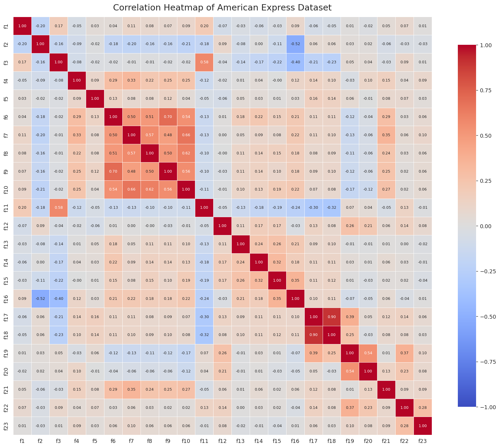
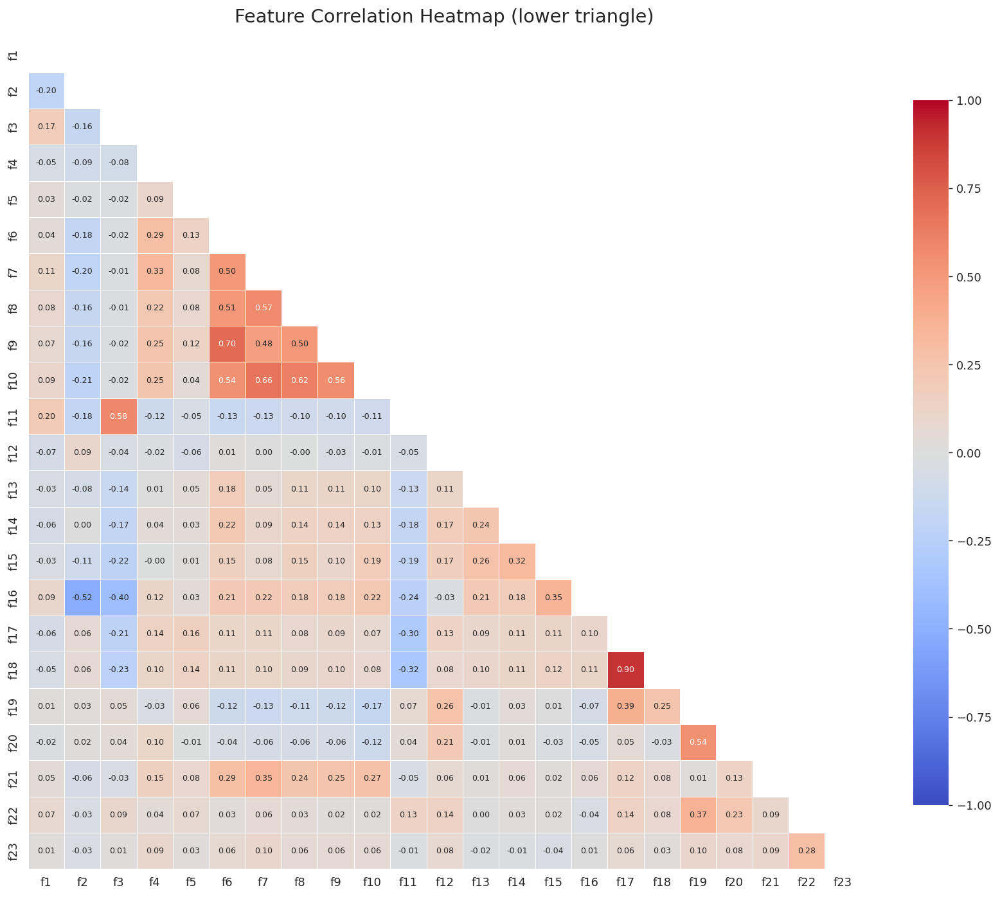
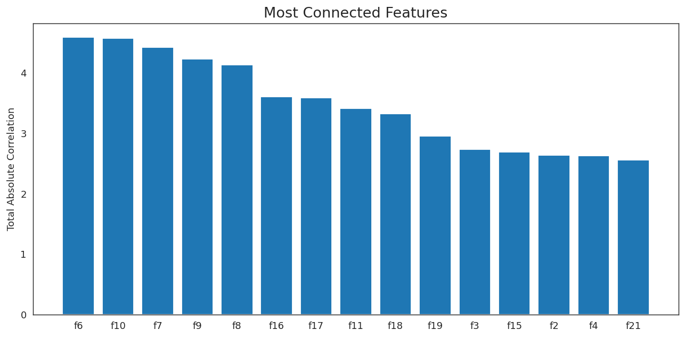

# Reverse-Engineering Credit-Card Profitability — American Express Campus Challenge 2026

> Given 500,000 masked credit-card members and **no answer key**, identify the 20% most
> profitable to the issuer — using only a live leaderboard and **10 submissions** as feedback.

This repo documents how we lifted top-20% identification accuracy from **0.823 → 0.883**
by treating the problem as a *controlled experiment* to reverse-engineer a hidden
profitability function — not by fitting a black-box model (there were no labels to fit to).

**Track:** Strategy | **Team of 2** | **Tools:** Python (pandas, numpy)

---

## The Problem

American Express provided a 500K-row dataset of premium ("Premier") cardmembers with ~23
**masked** attributes (spend, revolving balance, risk score, benefit usage, engagement).
The task: build a framework that quantifies each member's **profitability to the issuer**
and rank-orders them. Scoring = overlap between our predicted top 20% and the *actual*
(hidden) top 20%. Feedback came only from a public leaderboard, capped at 10 submissions.

There is no target label in the data, so supervised ML is impossible. The winning approach
is a **transparent revenue-minus-cost equation grounded in card unit economics**, then
calibrated against the leaderboard through disciplined experiments.

## The Approach

A credit-card issuer's per-customer profit is simply **Revenue − Cost**:

| Revenue | Cost |
|---|---|
| Interchange (a % of card spend) | Rewards liability (points earned/redeemed) |
| Net interest income (on revolving balances) | Benefit credits (lounge, airline, cab, entertainment) |
| Membership / supplementary-account fees | Expected credit loss (risk × exposure) |
| | Servicing & distress (collection / cancellation contact) |

Each masked feature was mapped to one of these levers, then weighted using published
premium-card economics and refined via the leaderboard.

## The Final Model (public score 0.883)

```
Profit =  0.037 × (f6+f7+f8+f9+f10)               # interchange on total spend
        + 0.42  × f1                               # net interest on revolving balance
        + 175   × f19                              # supplementary-account fees
        − 0.006 × (5×(f6+f9) + (f7+f8+f10))        # rewards cost (5× travel, 1× rest)
        − (35×f13 + f14 + 15×f15 + f16)            # benefit-credit outflow
        − 5.1   × f11 × f1                          # risk-adjusted expected loss (PD×EAD)
        − 400   × f3  −  30 × f2                    # collection / cancellation servicing
```

Because scoring is **rank-based**, only the *ratios* between coefficients matter, not their
absolute values. The economic story: reward high-spend, low-risk revolvers; penalise risky
revolvers and benefit-heavy members; treat membership fees as constant (excluded from rank).

**Deliberately excluded** (each falsified or reclassified by experiment):
- `f5` "total spend" — tested as the spend base, scored **0.388**; it correlates with nothing → noise.
- `f20` "# cards held" — reclassified as *engagement* (per Amex's own attribute taxonomy), not fee revenue; removing it lifted score to **0.847**.
- Points *redeemed* (`f21`) as the rewards-cost basis — tested, scored **0.756**; points *earned* is the correct basis.

## Results — the experiment arc

| # | Change tested | Score | Verdict |
|---|---|---|---|
| 1 | Economics baseline (category spend) | 0.823 | Baseline |
| 2 | Use `f5` as the spend variable | 0.388 | ❌ `f5` is noise |
| 3 | Increase spend weight (0.024→0.040) | 0.832 | ✅ spend matters more |
| 4 | Push spend weight further (→0.070) | 0.767 | ❌ overshoot → peak located ~0.037 |
| 5 | Remove `f20` (engagement, not revenue) | **0.847** | ✅ structural fix |
| 6 | Raise rewards cost (0.006→0.012) | 0.826 | ❌ cost not higher |
| 7 | Rewards cost → 0 | 0.819 | ❌ peak confirmed at 0.006 |
| 8 | Rewards on redemption (`f21`) | 0.756 | ❌ earned basis is correct |
| 9 | Risk-adjusted interest ↑ (0.18,0.9)→(0.30,3.0) | 0.876 | ✅ largest single gain (+0.029) |
| 10 | Continue interest ray →(0.42,5.1) | **0.883** | ✅ near the summit |

**Four hypotheses falsified, five improvements stacked** — every surviving coefficient is
attached to a measured result.

## Key Insights (from the EDA)

- **The dataset is capped (winsorised)** — for many features the top ~1% is clamped to a single ceiling value (99th percentile ≈ max), signalling a deliberately pre-processed dataset.
- **`f5` is a correlational island** — its strongest correlation with any other feature is 0.16, flagging it as noise before we ever spent a submission on it.
- **Correlation clusters mirror the economic groupings** — spend columns cluster (→ one Spend term), card counts cluster (→ Fees), risk score and collection calls cluster (→ one Risk term). Two independent methods agreeing = strong validation.
- **Risk direction confirmed** — `f11` correlates +0.58 with collection calls, proving higher = riskier.

## Exploratory analysis — figures

**Correlation heatmap of all 23 features.** The spend columns (`f6`–`f10`) form a tight
cluster, the lend-line pair (`f17`,`f18`) is nearly identical (r=0.90), and risk (`f11`)
tracks collection calls (`f3`, r=0.58) — these clusters map directly onto the model's
economic terms. `f5` correlates with nothing (max |r|=0.16), which is why it was flagged
as noise before any submission was spent on it.



**Lower-triangle view** (same data, easier to read):



**Most connected features** — total absolute correlation per feature. The spend cluster
(`f6`, `f10`, `f7`, `f9`, `f8`) dominates, confirming spend as the primary structured signal
and justifying its consolidation into a single Spend term:



## Methodology note

The core discipline: **change one thing per submission, and treat every score — including
drops — as a measurement.** A submission that fell to 0.388 wasn't a failure; it permanently
killed a wrong assumption for the price of one slot. Offline analysis (free, unlimited) was
exhausted before spending any (scarce) submission.

## Repo structure

```
├── README.md                    # this file
├── profitability_model.py       # the final model — reproduces the 0.883 submission
├── exploratory_analysis.py      # EDA: feature decode, capping, f5-island, correlation clusters
├── make_figures.py              # regenerates the figures below
├── correlation_heatmap.png      # + triangle + most_connected_features.png
├── experiment_log.md            # full hypothesis → result → learning log
├── requirements.txt
└── .gitignore                   # excludes the (proprietary) competition data
```

## Reproducing

The competition dataset is proprietary to American Express and is **not** included here. With
the data file in place, the analysis reproduces end to end:

```bash
pip install -r requirements.txt
python profitability_model.py     # writes the ranked predictions (0.883 submission)
python exploratory_analysis.py    # prints the EDA findings
python make_figures.py            # regenerates the figures above
```

---

*American Express Campus Challenge 2026 — Round 1, Strategy Track.*
*Author: [Your Name] · Teammate: Naba Fatima*
